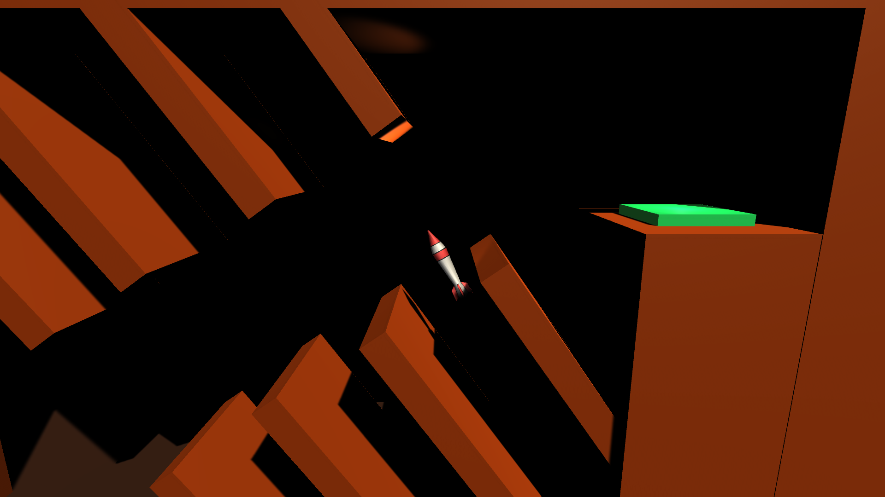
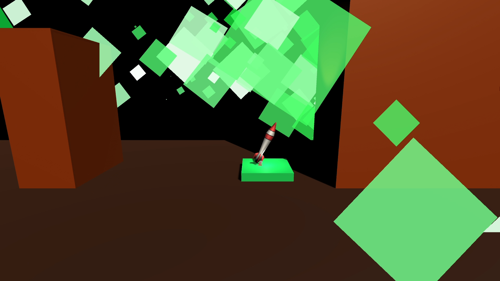

# Starship

A Unity-based rocket landing game where players control a spaceship to navigate through challenging environments, avoid obstacles, and successfully land on designated landing pads.

## Screenshots and Demo

### Gameplay Screenshot 1

### Gameplay Screenshot 2

### Game Demo

## Game Structure

This Unity project is organized as follows:

- **Assets/Scripts/**: Contains the core game logic scripts
  - `CollisionHandler.cs`: Manages collision detection and responses (crashes, successful landings, level transitions)
  - `Movement.cs`: Handles rocket movement, thrust, and rotation controls
  - `Oscillator.cs`: Provides oscillating movement for dynamic obstacles
  - `QuitApplication.cs`: Allows players to quit the game

- **Assets/Scenes/**: Contains different game levels
  - `Stablitiy.unity`: Stability challenge level
  - `Under.unity`: Under challenge level
  - `Over.unity`: Over challenge level
  - `Intermediate.unity`: Intermediate difficulty level
  - `Template.unity`: Template scene for level creation

- **Assets/Prefabs/**: Reusable game objects
  - `Rocket.prefab` and `Rocket - 2.prefab`: Player-controlled spaceship variants
  - `Ground.prefab`: Terrain objects
  - `Landing Pad.prefab` and `Launch Pad.prefab`: Landing/launch surfaces
  - `Obstacle.prefab` and `Moving Obstacle.prefab`: Environmental hazards

- **Assets/Audio/**: Sound effects for explosions, success, and engine sounds
- **Assets/Materials/**: Visual materials for game objects
- **Assets/Models/**: 3D models including the rocket
- **Assets/Particles/**: Particle effects for explosions and thrusters
- **Assets/Textures/**: Texture assets for visual elements

## What Was Implemented

- **Physics-based Movement**: Realistic rocket physics using Unity's Rigidbody component
- **Collision System**: Tag-based collision detection for friendly objects, finish pads, and obstacles
- **Audio System**: Sound effects for engine thrust, explosions, and success
- **Particle Effects**: Visual feedback for rocket engines, explosions, and landings
- **Level Progression**: Automatic level loading with wrap-around to first level after completion
- **Dynamic Obstacles**: Oscillating obstacles that move in sine wave patterns
- **Cheat System**: Debug keys for testing and level skipping
- **Multiple Levels**: Various challenge scenarios with different difficulties

## How the Game Works

The game is a physics-based rocket landing simulator. Players control a spaceship that must navigate through obstacle-filled environments to reach landing pads. The rocket uses realistic physics for movement and rotation.

### Core Mechanics:
1. **Thrust Control**: Spacebar provides upward thrust with audio and particle effects
2. **Rotation**: A/D keys rotate the rocket left and right with thruster particles
3. **Collision Detection**: Different object tags determine collision outcomes:
   - "Friendly": Safe collisions (no effect)
   - "Finish": Successful landing (level progression)
   - Default: Crash (level restart)
4. **Level Transitions**: Automatic scene loading with delay after success/crash
5. **Oscillating Hazards**: Moving obstacles that follow sine wave patterns

### Game Flow:
- Player starts in a level with the rocket at launch position
- Must navigate through obstacles using thrust and rotation
- Successful landing on finish pad advances to next level
- Crashing obstacles restarts the current level
- Game loops back to first level after completing all levels

## Player Controls

### Primary Controls:
- **Space**: Main engine thrust (upward force)
- **A**: Rotate rocket left
- **D**: Rotate rocket right
- **Escape**: Quit the game

### Debug/Cheat Controls:
- **L**: Skip to next level
- **C**: Toggle collision detection (for testing)

## Technical Details

- **Unity Version**: 2020.1.7f1
- **Physics Engine**: Unity's built-in PhysX
- **Audio System**: Unity AudioSource with 3D spatial audio
- **Particle System**: Unity Particle System for visual effects
- **Scene Management**: Unity SceneManager for level transitions

## Getting Started

1. Open the project in Unity 2020.1.7f1 or later
2. Load any scene from Assets/Scenes/
3. Press Play to start the game
4. Use Space, A, and D to control the rocket
5. Land on the green landing pads to progress

## Development Notes

This project demonstrates fundamental Unity concepts including:
- Physics-based gameplay
- Component-based architecture
- State management
- Audio and visual effects integration
- Scene management
- Input handling
- Collision detection</content>
<parameter name="filePath">d:\Unity Dev\Starship 2\starship\README.md